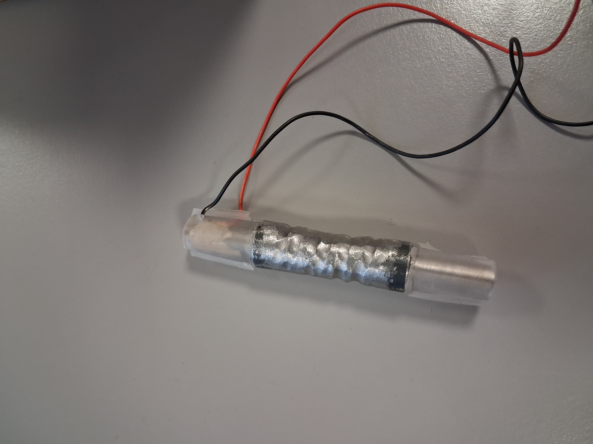
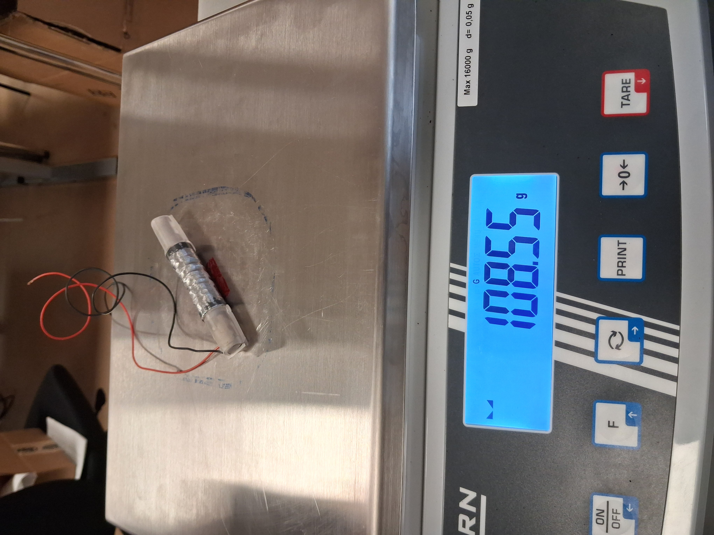
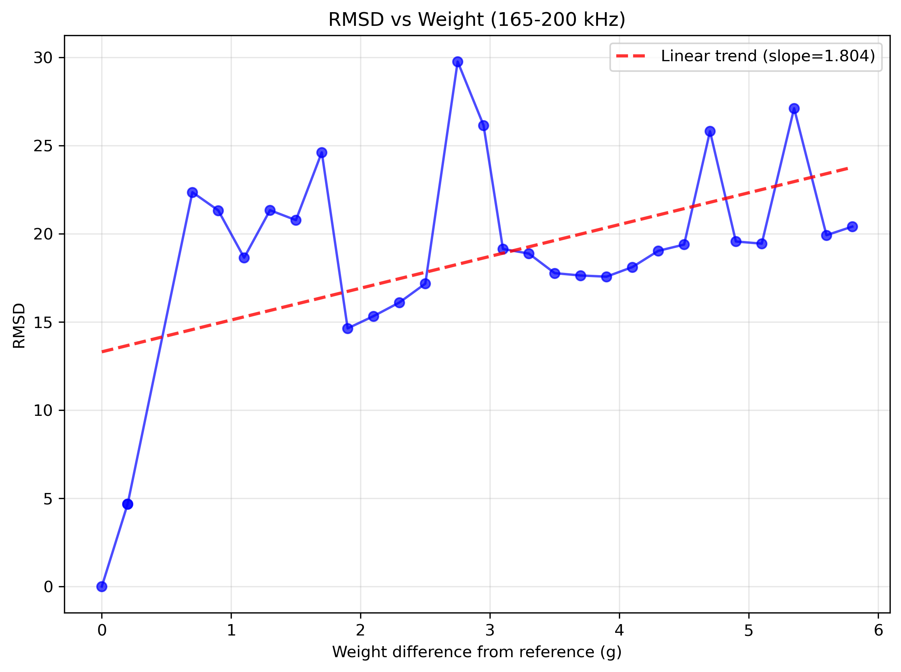
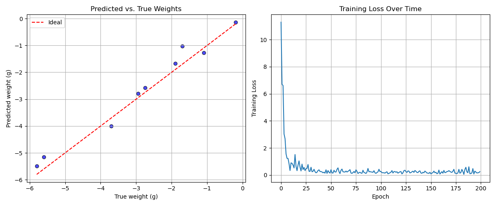
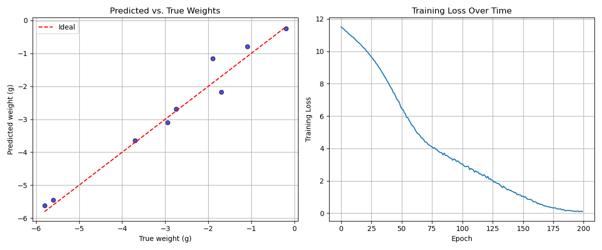

# ML Damage Analysis - Mehdi Dataset

Using ML on a real dataset to predict damage that is uniform-like. This project analyzes impedance data for weight prediction using machine learning models.

## Files

- `RMSD10.m` - MATLAB code by Mehdi
- `run_study.sh` - Converts `plot_explore_data.ipynb` to Python script and executes it
- `plot_explore_data.ipynb` - Main analysis notebook
- `Datafolder/` - Contains impedance sweep data (.mat files)

## Analysis Results

### RMSD Analysis
Root Mean Square Deviation of major peak in real part of impedance data:

### ML Predictions
Models trained on real part of impedance to predict weight:

Using 150-200kHz full dataset

Using 50-500kHz full dataset

**Key Finding:** Using just the major peak vs. full dataset yields similar performance, but peak-only analysis is significantly faster.
